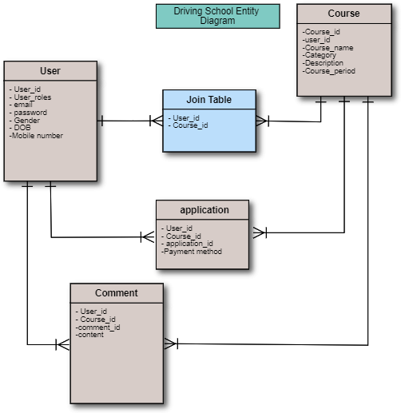
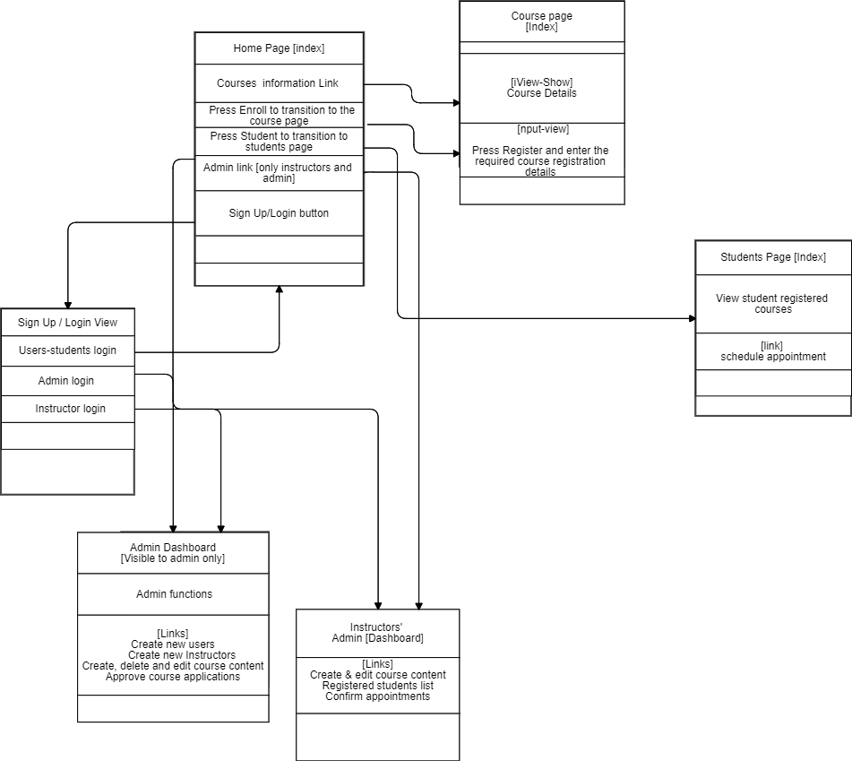

# README

## Overview
Through this project [Dynamic website] students would be able to access company services, create accounts to allow them to register for a course of choice and make payments, all in one sitting. It will also facilitate easy communication of changes to the courses and other updates

## Concept
Simple dynamic web app

## Version
* Ruby 2.6.5
* Rails 5.2.1

## Functions list
- [ ] Login function
- [ ] User registration/sign up function
  - [ ] Email address, name and password are required
- [ ] Password reset function
- [ ] course list display function
  - [ ] Show number of courses
  - [ ] Show number of
- [ ] course post function
  - [ ] name, category, description, and duration is required
- [ ] course edit function
- [ ] course deletion function
  - [ ] only instructors and admin can edit and delete courses
  - [ ] students can only view  course list and registered courses
- [ ] Course application function
  - [ ] users can apply for a course
  - [ ] Admin can approve applications
- [ ] Comment post function
    - [ ] users can post comments for clarifications on courses
- [ ] Admin functions
  - [ ] Only admin can add both instructor and user accounts

## Catalog Design
[Catalog Design Link](https://docs.google.com/document/d/1utfTTpQrPYAB3HXLfvqS88oLrv2vVJqF1BLziI6qtQI/edit#)

## Defining The Tables
[Table Definition Link](https://docs.google.com/spreadsheets/d/1cULE4jrao564zrvyAFPQfH5xpWEXRTGO/edit#gid=1915891721)

## ER Daigram

## Transitioning Screen

## Wireframe
[Wireframe Link](https://docs.google.com/document/d/1uNSxoU56xIbRztiEP1dTLvfPA4ptXC51bslguBddIP8/edit)

## To be used Gem
  * carrierwave
  * mini_magick
  * devise
  * gem rails_admin
  * gem 'semantic-ui-sass', '~> 0.15.4.2'
