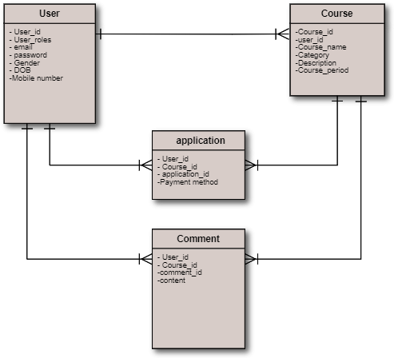

# README

## Catalog Design
[Catalog Design Link](https://docs.google.com/document/d/1utfTTpQrPYAB3HXLfvqS88oLrv2vVJqF1BLziI6qtQI/edit#)

## Defining The Tables
[Table Definition Link](https://docs.google.com/spreadsheets/d/1cULE4jrao564zrvyAFPQfH5xpWEXRTGO/edit#gid=1915891721)

## ER Daigram

## Transitioning Screen

## Wireframe

[Wireframe Link](https://docs.google.com/document/d/1uNSxoU56xIbRztiEP1dTLvfPA4ptXC51bslguBddIP8/edit)

This README would normally document whatever steps are necessary to get the
application up and running.

Things you may want to cover:

* Ruby version

* System dependencies

* Configuration

* Database creation

* Database initialization

* How to run the test suite

* Services (job queues, cache servers, search engines, etc.)

* Deployment instructions

* ...
